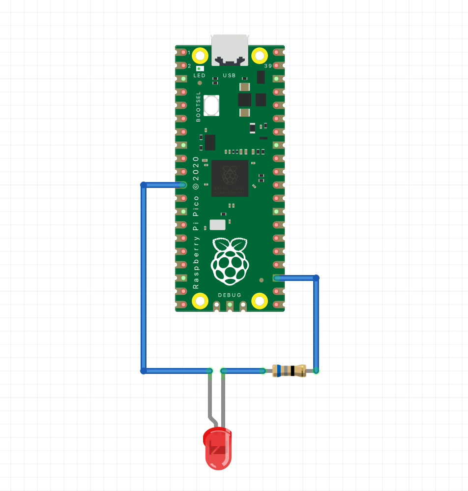

# Spooky activator
A little platform that enables you to light up whatever object is placed on it.
Brightness of the platform can be controlled via USB, conversely, it can be used standalone with the LED pulsating.

### 3d model
You can download the 3d models [here](https://www.thingiverse.com/thing:5006784).

### Wiring

### Installation
1. Compile the source code, you will need the UF2 version.
2. Push and hold the BOOTSEL button and plug your Pico into the USB port of your computer. Release the BOOTSEL button after your Pico is connected.
3. It will mount as a Mass Storage Device called RPI-RP2.
4. Drag and drop the UF2 file onto the RPI-RP2 volume.

### Support the project
If you would like to support what I do and keep me caffeinated, you can do it here:

